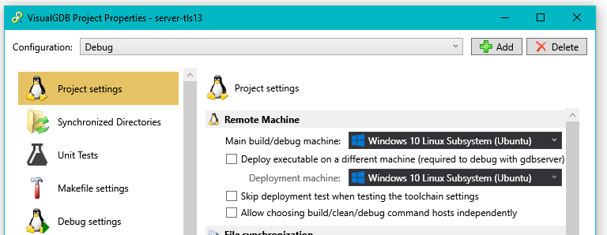
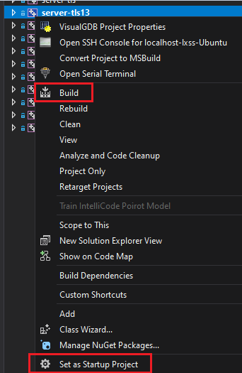
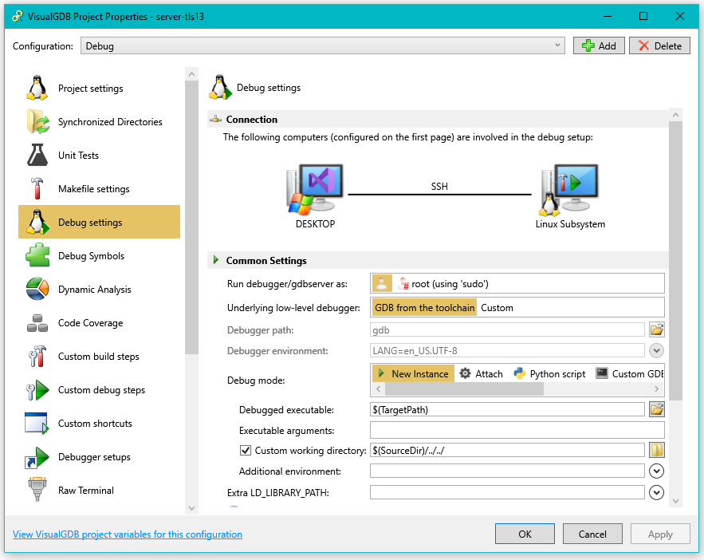
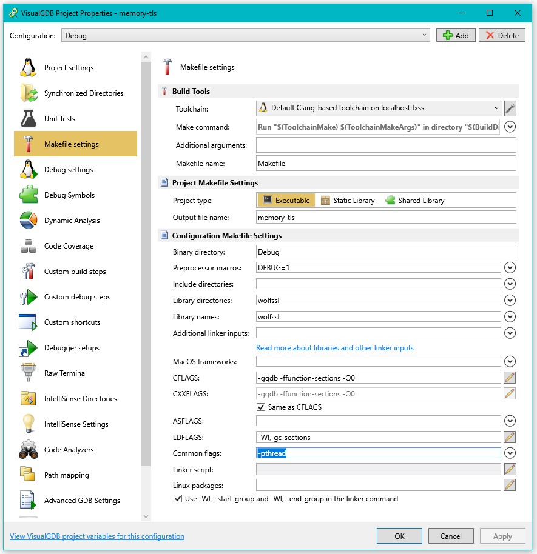
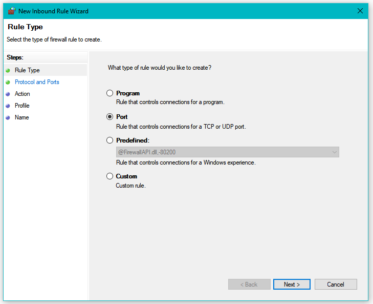
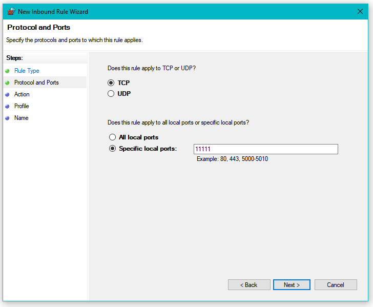
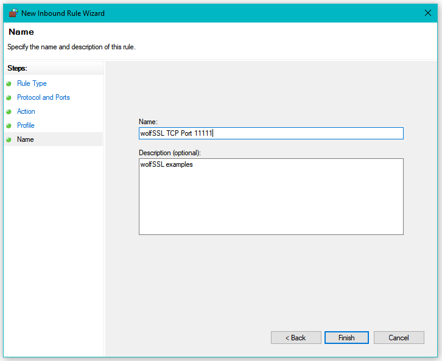

# wolfSSL TLS Examples in Visual Studio

<<<<<<< HEAD
These examples use the VisualGDB extension for Visual Studio and assume WSL is already installed with toolchain.

Basic steps to create a new wolfSSL example:

Step 1:


Step 2:


Step 3:


Step 4:


Step 5:


Step 6:


Step 7:


All of the code refers to source in `..\..\tls`


## Troubleshooting

=======
These examples use the VisualGDB extension for Visual Studio and assume WSL (or a remote Linix box) is already installed with toolchain.

## Running VisualGDB Examples

Be sure to seelct the `Set as startup project` as shown below. Then press `F5` to start debugging, or `F11` to step-into.

The target build machine is found by right-clicking on the project name and selecting `VisualGDB Project Properties`:



<br />

## Building VisualGDB Examples

Right-click on a project and select `Build`:




VisualGDB will give an output message at build time:
```
Run "make  CONFIG=Debug" in directory "/mnt/c/workspace/wolfssl-examples/tls/VisualGDB-tls/server-tls13" on (Windows 10 Linux subsystem)
```
Run the respective command in WSL:

```
cd /mnt/c/workspace/wolfssl-examples/tls/VisualGDB-tls/server-tls13
make  CONFIG=Debug
```
with expected output:
```
0 $  make  CONFIG=Debug
mkdir Debug
clang -ggdb -ffunction-sections -O0   -DDEBUG=1  -c ../../server-tls13.c -o Debug/server-tls13.o -MD -MF Debug/server-tls13.dep
clang++ -o Debug/server-tls13 -Wl,-gc-sections   -Lwolfssl -Wl,--start-group Debug/server-tls13.o -lwolfssl  -Wl,--rpath='$ORIGIN'   -Wl,--end-group
gojimmypi@DESKTOP(WSL): /mnt/c/workspace/wolfssl-examples/tls/VisualGDB-tls/server-tls13 (ESP32_development * u=) gojimmypi/wolfssl-examples
```
the working directory needs to be `/mnt/c/workspace/wolfssl-examples/tls` to find the hard-coded certs in `.wolfssl-examples/certs`.
```
cd /mnt/c/workspace/wolfssl-examples/tls

./VisualGDB-tls/server-tls13/Debug/server-tls13
```
should give an output like this:
```
0 $  cd /mnt/c/workspace/wolfssl-examples/tls
gojimmypi@DESKTOP(WSL): /mnt/c/workspace/wolfssl-examples/tls (ESP32_development * u=) gojimmypi/wolfssl-examples

0 $  ./VisualGDB-tls/server-tls13/Debug/server-tls13
Waiting for a connection...
```


## Creating Examples

Basic steps to create a new wolfSSL example:

Step 1: use the VisualGDB Linux Project Wizard. 


Step 2: pick a directory to store project files.


Step 3: pick a build type and language.


Step 4: select a Linux compouter. The projects assume WSL is installed locally, but any 
accessible remote Linux box should also work.

Note that if you have multiple WSL installations, it is usually best to pick an explicit one instead of 
the default distribution.


Step 5: This step will verify the connection and toolchain:


Step 6: Optionally set an path mappings. (none are used in these samples)


Step 7: Observe included directories.


All of the code refers to [source](../README.md) in `../../tls` with respect to each project directory.

In order to accomodate the cert files in `../certs` relative to the source directory,
the custom working directory is set to `$(SourceDir)/../../` this will typically
evalauate from:

```
$(SourceDir) = /mnt/c/workspace/wolfssl-examples/tls/VisualGDB-tls/server-tls13/
```
to a value of
```
/mnt/c/workspace/wolfssl-examples/tls/VisualGDB-tls/server-tls13/../../
```
or more specifically:
```
/mnt/c/workspace/wolfssl-examples/tls/
```
with the example certs in
```
/mnt/c/workspace/wolfssl-examples/certs/
```

 

## Troubleshooting

### Could not identify the WSL2 network interface. No network interfaces with the (WSL) tag found.

This error may occur if there are multiple WSL distros installed, or different from the one saved here. Pick a WSL:


>>>>>>> 3661692c1325fc5fff97c81268f1666462fb771a

### Failed to start GDB session


Make sure to build the project before single-step debugging.

### Samples not working

Check to see if the server process is still running: `ps -aux | grep server`

Check working directory. Many samples refer to `../certs/` for sample key files.

### error adding symbols: DSO missing from command line

If when compiling:

```sh
clang++ -o Debug/memory-tls -Wl,-gc-sections   -Lwolfssl -Wl,--start-group Debug/memory-tls.o -lwolfssl  -Wl,--rpath='$ORIGIN'   -Wl,--end-group
```


```text
/usr/bin/ld: Debug/memory-tls.o: undefined reference to symbol 'pthread_create@@GLIBC_2.2.5'
/usr/bin/ld: /lib/x86_64-linux-gnu/libpthread.so.0: error adding symbols: DSO missing from command line
clang: error: linker command failed with exit code 1 (use -v to see invocation)
```

Be sure to set `-pthread` in Makefile settings - Common Flags:




## Firewall

May need to allow Windows Firewall to listen on GDB ports:

<<<<<<< HEAD

=======


It may be useful to setup an explicit port rule:

Right click on `inbound rules` in Windows Defender with Adfanced Firewall and select
`New Inbound Rule`:


Select `Port` as the new Rule Type:



Select `TCP` and Specific local port `11111` for the default examples (or whatever port you choose to use to listen on)



Select 'Allow the connection` on the next step:


The `Private` profile is typically acceptable, but may vary depending on local computer settings and environment.


Name the rule, provide and optional description, and press the `Finish` button:



<br />

## Other examples

See [wolfssl-examples](../../README.md)


<br /> 

## Support

Please contact wolfSSL at support@wolfssl.com with any questions, bug fixes,
or suggested feature additions.


>>>>>>> 3661692c1325fc5fff97c81268f1666462fb771a
